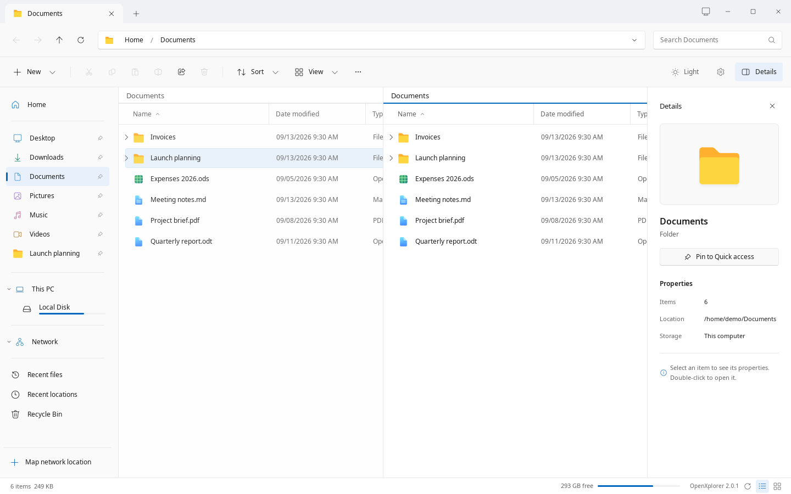

# OpenXplorer

A Windows File Explorer-inspired file manager, **developed for Zorin OS first and foremost**. Zorin is the primary target for its desktop experience and integration; Ubuntu and Debian are secondary compatibility targets and require compatible system packages.

Browse local folders, SMB shares and SFTP, FTP, WebDAV and NFS locations with tabs, split panes, a folder tree, Details, Compact, List and icon views with thumbnails, clickable paths, pinned folders, search, undoable file operations and light/dark themes.

**[Releases](https://github.com/AKolenda/openxplorer/releases)** · **[Website](https://openxplorer.app)** · **[Installation](docs/installation.md)** · **[Documentation](docs/introduction.md)**




*The native GTK 4 app, captured in an isolated session with fictional files: the Details view, and split panes (F3). Network examples in these pictures do not establish live SMB compatibility.*

## Install

Version **2.0.1** is a native GTK 4 application written in Rust (`native/`). It keeps the same look, settings, pins and saved passwords as 1.x; see the [changelog](CHANGELOG.md) for what 2.0.1 adds. Get it from [GitHub Releases](https://github.com/AKolenda/openxplorer/releases):

- **Zorin OS 18, Ubuntu 24.04 and newer, Debian 13:** `openxplorer_2.0.1_all.deb` (x86-64). OpenXplorer 1.1.x offers it in **Check for updates**.
- **Fedora, openSUSE Tumbleweed, Arch Linux:** the `.rpm` or `.pkg.tar.zst` of the release, when the release lists one.
- **Any distribution with Flatpak**, including Debian 12 and others with GTK older than 4.14: `io.winspace.Development.flatpak`.

Follow the [installation guide](docs/installation.md), and finish file operations and run `openxplorer --quit` before upgrading. See the [changelog](CHANGELOG.md), the [known gaps and backlog](native/BACKLOG.md), the [packaging guide](native/packaging/README.md) and the [release checklist](docs/RELEASE-CHECKLIST.md).

## Develop

The app lives in `native/` (Rust, GTK 4, GIO/GVfs); see [native/README.md](native/README.md). It needs Rust 1.92 or newer and the GTK 4.14+, SQLite and libsoup 3 development packages (`libgtk-4-dev libsqlite3-dev libsoup-3.0-dev` on Ubuntu and Debian):

```sh
cargo build --release --locked --manifest-path native/Cargo.toml
python3 native/tools/check.py
```

No package ships Python; the persistent SMB mount helper is a Rust program too. The Next.js website lives in `apps/web/`. The installed app does not depend on Node or pnpm.

**Retired:** the Python/GTK 3/WebKitGTK app of OpenXplorer 1.x is no longer in the tree, released or maintained. Its last release is tag [v1.1.4](https://github.com/AKolenda/openxplorer/tree/v1.1.4); its final sources, which `native/parity/` cites as the behavioural specification, are `desktop/` at tag [v2.0.0](https://github.com/AKolenda/openxplorer/tree/v2.0.0/desktop).

For the website, use Node.js 22.13+ and pnpm 10.34.5:

```sh
pnpm install --frozen-lockfile
pnpm dev
```

See [native setup](native/README.md), [website setup](apps/web/README.md) and the [development guide](docs/development.md) for prerequisites, builds and checks.

## Contribute

Read [CONTRIBUTING.md](CONTRIBUTING.md) and submit a pull request from a feature branch. `main` requires PRs, including for administrators. Report vulnerabilities using [SECURITY.md](SECURITY.md).

## License

Project changes, website and project-authored documentation are **[AGPL-3.0-only](LICENSE)**, with documented file-level exceptions. Preserve the upstream Winspace [MIT notice](licenses/Winspace-MIT.txt), [NOTICE](NOTICE) and [third-party notices](THIRD_PARTY_NOTICES.md).

Independent project; not affiliated with Microsoft, Zorin, Canonical, Debian or Vercel. No warranty.
