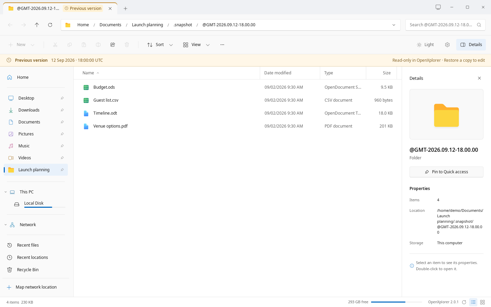
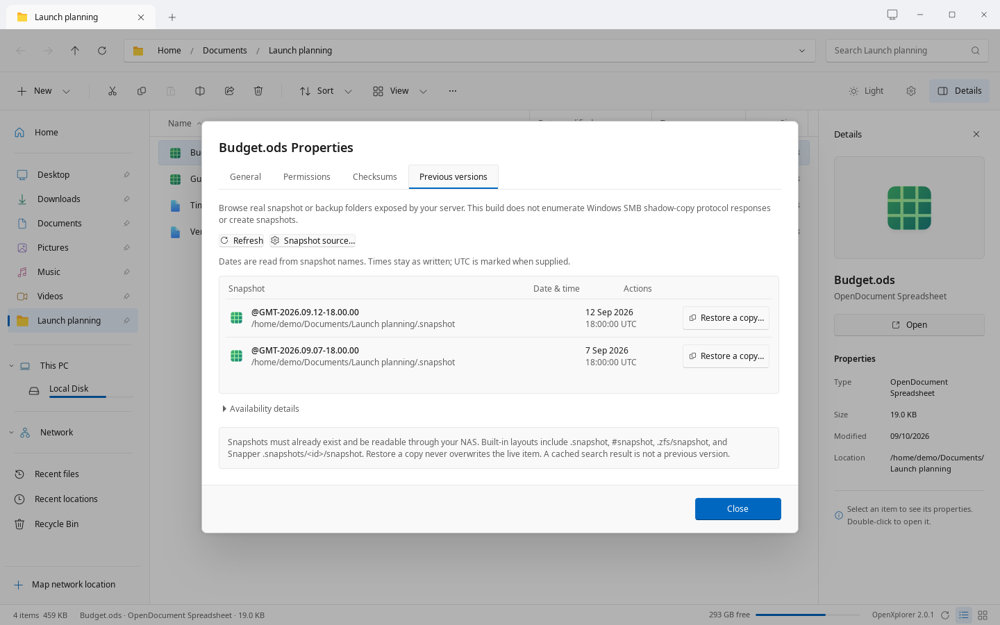

# Interface & snapshots

Make the workspace fit the way you work.

## Your workspace, your widths

Resize the sidebar and column edges. Double-click an edge to reset or fit it, depending on the control. Width preferences survive restarts. Local and SMB ancestors remain individual breadcrumb buttons.



*The native app, captured with fictional sample files. No live NAS connection.*

## Choose a folder view

View offers Details, List and icon sizes. Use Ctrl+mouse wheel or the status-bar slider to change icon size. Details can expand folders in place; drag from empty space to select items, hold Ctrl to toggle them or Shift to add them. View → Compact view, also in Settings → Appearance → Files and folders, draws the Details rows and the navigation pane closer together, as in Windows 11, so more items fit.

Right-click a Details heading to choose columns, then drag headings to reorder them. The Recycle Bin includes Original location and Date deleted. Sort is laid out like Windows Explorer’s: Name, Date modified and Type, with Size and the other file properties under More. Sort › Group by groups the folder apart from its sort, so a folder grouped by date modified can be sorted by name within each group: choose Name (A – H, I – P, Q – Z), Date modified, Type, Size, Date created, Same as sort (groups that follow the sort), or (None). Downloads is grouped by date modified until you choose otherwise there. Sort also has a Folders first switch. Relative dates include the time; Settings → Appearance → Files and folders can show absolute dates instead.

## Two folders in one tab

Press F3 or choose View → Split view to open two panes. Click either pane to make its path, selection and commands active. Each pane keeps its own folder and history. F3 again closes the active pane and keeps the other.

Settings → Windows & tabs → Startup lets you choose where new windows open and enable Restore previous tabs at startup. Session restoration is off by default. New tabs normally open beside the current tab.

## Previews and the folder tree

Settings → Appearance → Files and folders controls thumbnail previews, file types and the large-file limit. Previews in network folders are off by default. Missing previews use the desktop thumbnail service when available; supported local images can be generated by OpenXplorer. Files that cannot be previewed keep their icons.

View → Folder tree (F7) shows a tree of folders below the navigation places. Expand a folder to read its subfolders. Its menu controls hidden folders, limiting the tree to Home and following the active folder. Settings → Appearance → Layout → Hide expand arrows takes away the arrows beside This PC and Network, in the folder tree and beside folders in the file list, as in Windows; Right and Left still open and close folders in place. Recent locations lists folders from desktop history and offers Clear recent locations.

## Templates, shortcuts and help

Your Templates folder supplies entries directly in New, with its subfolders as submenus. Choose a template and a new name; creating from a template never overwrites an existing file.

More options → Keyboard shortcuts (Ctrl+?) lists the available keys. F1 opens the built-in manual without a network connection. Report an issue opens the project issue tracker only when selected.

## Follow file operations

Copy, move and delete jobs have their own progress panels. Pause, Resume and Cancel apply to the chosen job. Speed is shown while transferring bytes; estimated time remaining appears when the total is known.

Up to four independent jobs can run while you browse. A job that overlaps an active source or destination must wait for that job to finish. Rename, archive operations, restore and Undo run on their own. If an item fails, Retry, Skip and Skip all let you choose how to continue.

## Add installed service actions

Choose Configure service actions from a folder or item menu, enable the installed actions you trust, then Save. Matching enabled actions appear under Service actions. Edited definitions must be enabled again.

OpenXplorer reads supported KDE service-menu definitions and executable Nautilus scripts from XDG data folders. Selected paths are passed as separate arguments. Terminal launchers, interpreter commands and embedded field substitutions are unsupported.

## Open a protected folder

Open as administrator on a local folder’s menu asks for confirmation before opening an admin:/// location. GVfs requests desktop authentication through polkit; OpenXplorer itself keeps running as your user. The feature needs your distribution’s GVfs administrator backend.

Administrator access does not remove OpenXplorer’s protection of snapshot folders. Restoring a session reopens administrator locations with ordinary permissions.

## Choose your context menu

Windows 10-style classic menus are the default; Settings can switch to the Windows 11-style compact option. Open with uses registered applications; identical editor names are deduplicated.

## Previous versions

Properties → Previous versions can browse existing, exposed snapshot collections. Opening a snapshot in another tab retains the original dialog on its originating tab. Restore a copy writes to a separate destination, not over the live original.

This provider recognizes exposed filesystem directories. It does not implement the Windows SMB shadow-copy enumeration protocol, create snapshots, or make backup history exist on a server.

Each previous-version row now includes a right-aligned date and time, followed by Browse and Restore a copy actions. Dates are parsed from recognized snapshot names, including auto-2026-09-04_16-30, 2026-09-05_180000, and @GMT names. A visible “From snapshot name” label explains the source. Unrecognized names show “Date unavailable”; folder modification times are not passed off as snapshot creation times.

@GMT timestamps are marked UTC. Other names are shown as written, without guessing a server timezone. This is display metadata, not a server-side ZFS creation-property query.

Snapshot tabs carry a “Previous version” badge and an amber top edge. A banner identifies the historical view and its read-only treatment in OpenXplorer, including when browsing deeper inside it. Network snapshot tabs keep their green network marker. The original Properties dialog still belongs to the original tab.



*The native app, captured with fictional sample files. No live NAS connection.*

## Measure folder sizes on demand

Calculate folder size totals accessible logical file sizes on a worker with progress and cancellation. Limits, excluded entries and read errors are shown as incomplete coverage. Results are session-only and can become stale.

These are not ZFS dataset used/referenced values, compressed allocation measurements or snapshot-exclusive block counts.

## Browse a ZIP, without extracting everything

ZIP browsing is read-only. Listing reads archive metadata; opening a selected member decompresses that member into a private temporary copy. Archive modifications, encrypted archives and unsupported formats require an external application.

## Extract ZIP files

Select a ZIP and click Extract all in the command bar, or right-click it and choose Extract all… in either context-menu style. As in Windows Explorer, one field says where the files go, filled in with the ZIP's folder and name (for example Downloads/tidewater); Browse… picks another folder. A folder that does not exist yet is created. Delete the last part to extract straight into an existing folder such as Downloads: if a file with the same name is already there, you are asked whether to replace or skip it. A ZIP holding one folder of the same name is not nested (no tidewater/tidewater). The ZIP stays unchanged, and Cancel is available in the transfer panel. The ⓘ button at the bottom left shows how many files the ZIP holds, a few notes, and Open in archive manager, which opens your archive manager (such as Ark) even when OpenXplorer opens ZIPs by default. A password-protected ZIP cannot be extracted here: the dialog says so and offers the archive manager.

To browse ZIPs like Windows Explorer does, set Settings → Windows & tabs → Open ZIP files to Like a folder. Opening a ZIP then shows it in the tab: the address bar shows the path through it, folders inside open in the tab, Back and Up work, and Extract all appears in the bar. The ZIP stays read-only; Copy (then Paste anywhere) and dragging items out hand over real copies, which OpenXplorer unpacks into ~/.cache/winspace/zip-copies and removes after a day. The default, In a pop-up window, keeps the Compressed folder window.

Local and already connected SMB locations are supported by the implementation; live SMB extraction still needs target-machine validation. Sign into the relevant shares first. Password-protected ZIPs, unsupported methods, and files exceeding the built-in safety limits need an external archive manager. Double-click continues to browse without extracting the entire ZIP.

## Make text easier to read

Ctrl + (or Ctrl =) increases text, Ctrl − decreases it, and Ctrl 0 resets to 100%. Settings → Appearance & layout → Text size offers 80% through 200%. The preference is saved across restarts and applied to open windows.

Only the application text and needed row spacing change; desktop scaling and file data remain unchanged. Sidebar and column widths remain resizable.

## Open in Terminal

Right-click a folder, sidebar pin or the file-list background and choose Open in Terminal. Right-click a regular file to open its containing folder. Both context-menu styles include the command.

A connected SMB location needs a usable local CIFS or GVfs-FUSE mount. The shell runs on your Linux computer, not on the NAS. No SSH session or remote command is created. Server listings, ZIP contents and protected snapshot views cannot be used as a terminal directory.

The system terminal alternative is used when supported; otherwise an installed GNOME Terminal, Console, Xfce Terminal, Konsole or XTerm is selected. Paths are passed as literal arguments and working directories, not shell command strings. View → Terminal opens the configured external terminal; the website tour shows pictures and starts no program.

```sh
sudo apt install gnome-terminal
```

## Middle-click and move tabs

Middle-click a folder, connected share, breadcrumb or sidebar location to open a background tab. Shift+middle-click also switches to it. Middle-click an existing tab to close it. Background directories load when selected, so opening a network tab does not immediately interrupt you with a login dialog.

Drag a tab onto another OpenXplorer tab strip to merge it. To open a separate window, drop on a supported desktop, or drag down into the source window until the new-window hint appears. The Move tab to new window menu remains available. Escape cancels; the original tab is kept until the destination acknowledges it.

## Drag files between applications

Select one or more files or folders and drag them into an application that accepts native file drops. The desktop app supplies file URIs and readable paths through GTK, including already-mounted network paths when available. Ctrl-click or Shift-click to select multiple items. Press Escape to cancel.

Drop files into an OpenXplorer folder, the empty area of the current folder, or another OpenXplorer window to propose a copy. Choose Replace existing or Skip duplicates. Incoming data is staged before file replacement; same-name folders merge and keep destination-only entries. File/folder type conflicts are left unchanged. Quick access drops pin or reorder folders. File drops never request deletion of the source.

ZIP members must be extracted first. Some editors only accept local files: network items need an existing GVfs/FUSE or CIFS path for those applications. Dragging does not mount a share or download a temporary copy. Drag-to-move, automatic extraction, and undo remain unavailable; use Cut and Paste for supported same-filesystem moves.

The website tour shows pictures and cannot drag files. Compatibility with a particular editor or a Wayland desktop must be checked on that system.

---

OpenXplorer 2.0.1. Project-authored documentation: AGPL-3.0-only.
