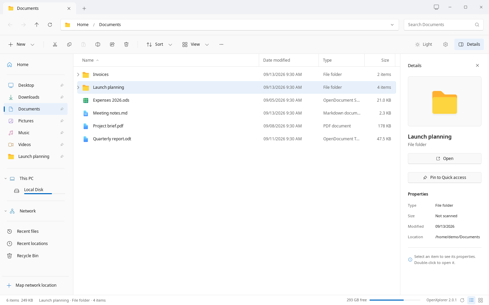

# Introduction

A familiar way to explore. A different kind of ownership.

## Meet OpenXplorer

OpenXplorer is a Windows File Explorer-inspired file manager for Linux, built for Zorin OS and intended to extend to compatible Ubuntu and Debian installations. It brings a familiar tabbed interface to your local folders and SMB shares.

Previously called Winspace, the project is now published as OpenXplorer. The desktop application and this website are distributed under AGPL-3.0-only; original third-party notices remain intact.

*The native app, captured with fictional sample files. No live NAS connection.*

## Your files. Your network. Your workflow.

Navigate with clickable breadcrumbs, pin folders, type to select a filename, resize columns, and use either a classic or compact context menu. Search opted-in filename indexes, browse ZIP contents read-only, and inspect existing exposed snapshots.

The tour below shows pictures of the real native app, captured with fictional sample files: click a control in a picture to see where it leads. It cannot access your computer, NAS, browser settings or keyring. On a desktop-sized screen, use the buttons above the tour to open a scene, switch appearance, or play a short walkthrough. The tour is not loaded on phones; the documentation and screenshots remain available.

- Local files and SMB shares in one interface.
- A searchable Settings page, with explicit controls for desktop integration.
- Source included alongside the installer; no account needed to use the app.

[Open the click-through tour of the real app](../tour/index.html): pictures of the native app with sample files, no access to your computer.

## Native storage. Local interface.

Since 2.0.0 the desktop app is a native GTK 4 application written in Rust. GIO/GVfs provides the filesystem, SMB and phone layer; SQLite stores the optional filename index. The Python/WebKitGTK app of 1.x is retired; its last release, 1.1.4, stays available as a tag of the public repository. This Next.js website is separate and is not required to run the app; its tour shows pictures of the native app.

## Know what you are installing

Version 2.0.0 replaces the Python app with the native GTK 4 app under the same name, settings and saved passwords, and adds Fluent icons, a categorised Settings page, undo, and Flatpak and distribution packages. Zorin is the primary target; Ubuntu 24.04+, Debian 13, Fedora, openSUSE and Arch are supported through their packages, and every other distribution through the Flatpak. Version 2.0.1 adds split panes, a Compact view, a folder tree, thumbnails, transfer jobs with undo, SFTP, FTP, WebDAV and NFS locations, content search and optional Open and Save dialogs for other apps. The known gaps are listed in the changelog.

> Use a disposable folder and a non-critical share first. SMB servers other than the maintainer's, phones and USB drives have not yet been accepted on real hardware with the native app.

## Start with one folder

Read Installation, open your home directory, and test a network share. Enable indexing and default-file-manager integration only after checking basic file operations.

---

OpenXplorer 2.0.1. Project-authored documentation: AGPL-3.0-only.
